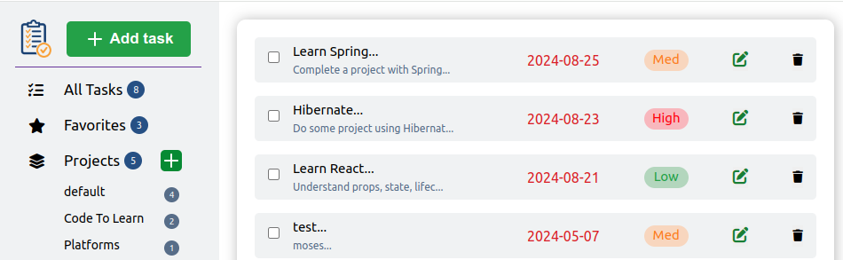

# member-moses-to-do-list
A simple To-Do List App using various JavaScript concepts and **SOLID** OOP Principles.

## Live
Check it out live [**here**](https://agile-learning-institute.github.io/member-moses-to-do-list/).

## Setup Locally
1. Fork and Clone the repository  
    `git clone git@github.com:agile-learning-institute/member-moses-to-do-list.git`  

2. Install Packages  
    `cd member-moses-restaurant-page`  
    `npm install`  

3. Spin it up  
    `npm run build`  
    `npm run start`  